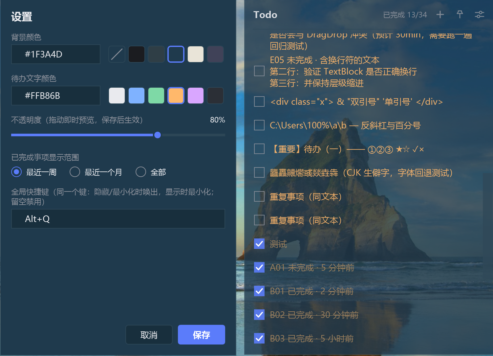

# TodoWidget

Windows 桌面待办组件：无边框小窗口，可以钉在桌面一角、贴边自动隐藏、拖边缘改大小，不占任务栏，靠托盘图标和全局快捷键操作。

<p align="center">
  
</p>

## 运行

开发运行：

```powershell
dotnet run --project src/TodoWidget.Desktop/TodoWidget.Desktop.csproj
```

免安装发布（自包含单文件，用户解压后直接运行，不需要装 .NET Runtime）：

```powershell
dotnet publish src/TodoWidget.Desktop/TodoWidget.Desktop.csproj -c Release -r win-x64 --self-contained true /p:PublishSingleFile=true -o publish/win-x64
```

然后运行 `publish/win-x64/TodoWidget.Desktop.exe`。开发需要 .NET SDK 10（`net10.0-windows`）。

## 功能

### 窗口

- 无边框直角窗口，标题栏按住可拖动；把鼠标移到窗口边缘或四角（约 6px 感应带）可拖动改变大小，最小 220×160
- **边缘隐藏**：拖到屏幕边缘 18px 内松手，窗口整体移出屏幕（0 像素可见）。鼠标碰到该屏幕边缘、且落在原停靠位置的高度范围内，窗口滑出显示；**鼠标离开后自动收回**。只有把窗口拖离边缘才会解除停靠
- **不占任务栏**：任务栏与 Alt+Tab 都不出现
- **托盘图标**：通知区域是唯一可见入口。双击切换显示/隐藏；右键菜单含「显示 / 隐藏」和「退出」
- **开机自启**：首次运行登记到 `HKCU\Software\Microsoft\Windows\CurrentVersion\Run`（值名 `TodoWidget`，无需管理员权限）；从托盘菜单退出时会删除该启动项，之后不再自动登记（也尊重你在系统设置里关掉它）
- **全局快捷键**：单一按键，默认 `Alt+Q` —— 窗口隐藏或最小化时唤出并激活，正常显示时最小化；可在设置里改或留空禁用

### 事项

- 新建：点标题栏的 **➕**，在未完成组普通区开头出现内联输入行，回车提交（Shift+Enter 换行，Esc 取消）
- 编辑：双击事项文本，或悬停行时点铅笔图标。输入区随内容自动增高；Enter 提交、Shift+Enter 换行
- 删除：悬停行时点垃圾桶图标 → 弹出确认气泡（可撤销前先确认），Esc 或点外部取消
- **置顶**：悬停行时点图钉图标。置顶事项始终排在未完成组最前（多个置顶按置顶先后），行右侧常驻强调色图钉标记；置顶项完成后与普通事项一致；已完成事项不可置顶
- 排序：在各自分组内拖动排序；未完成恒在已完成之前
- 完成：勾选复选框，事项移到已完成组首位并显示中划线
- 显示范围：设置里可选**已完成事项**的显示范围——最近一周（7 天）/ 最近一个月（30 天）/ 全部。**未完成事项始终显示**，不受范围影响；超范围的已完成事项仍完整保存在数据文件里

### 外观

- 背景颜色（预设含 **无背景**：面板不填充也不描边，只有文字浮在桌面上）、待办文字颜色、不透明度
- 三项均**即时预览**：改动立刻作用到运行中的窗口，点保存才落盘，取消则回滚
- 待办文字颜色只作用于首页事项文本；标题栏、图标、设置窗口的颜色由背景明暗自动决定
- 界面字体固定微软雅黑；窗口/行/输入框/复选框为直角，按钮为 4px 圆角

## 数据与设置

事项和设置保存在：

```text
%LOCALAPPDATA%\TodoWidget\state.json
```

即 `C:\Users\<用户名>\AppData\Local\TodoWidget\state.json`（当前用户的本地目录，不随账号漫游，也不需要管理员权限）。

文件是 UTF-8 的 JSON，中文以**原字符**写入（不做 `\uXXXX` 转义），可以直接查看和编辑；**编辑请在应用关闭时进行**，否则应用保存时会把内存中的完整状态覆盖回去。

以「完整内存快照 → 同目录临时文件 → Flush → 原子替换」的方式写入，保存失败不会用空数据覆盖原文件；JSON 损坏时保留原文件并用默认状态启动，同时在窗口内提示。

## 开发

```powershell
dotnet build TodoWidget.sln
dotnet run --project tests/TodoWidget.Tests   # 无第三方依赖的回归测试
```

项目结构与规格文档：

```text
src/
  TodoWidget.Core/          # 事项模型、排序/完成/置顶、停靠几何计算
  TodoWidget.Persistence/   # JSON 状态文件、原子保存、损坏保护
  TodoWidget.Desktop/       # WPF 窗口、设置、托盘、停靠、全局快捷键
tests/
  TodoWidget.Tests/         # 可执行回归测试
codespec/
  SPEC.md                   # 全量需求（行为）
  DESIGN.md                 # 全量设计（技术决策）
todo.ico                    # 应用与托盘图标（9 档 16~256）
```
